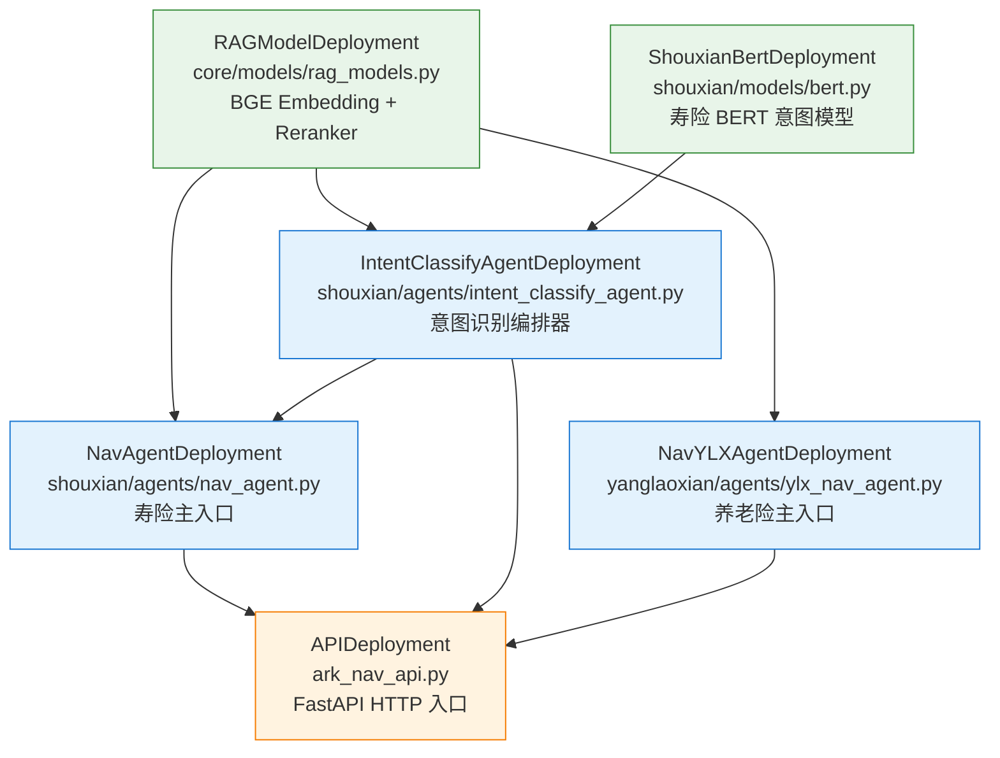
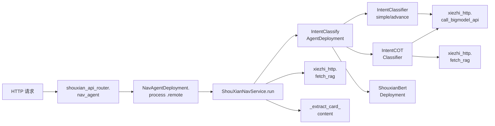
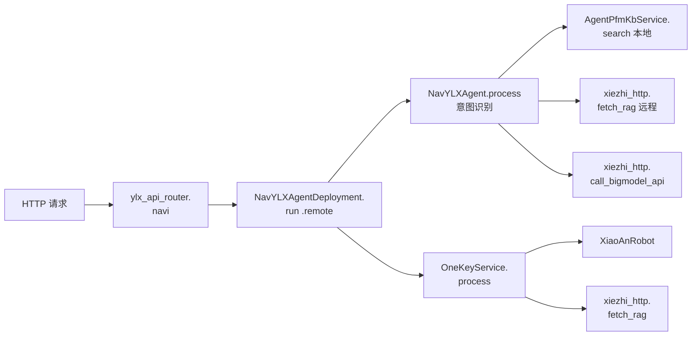
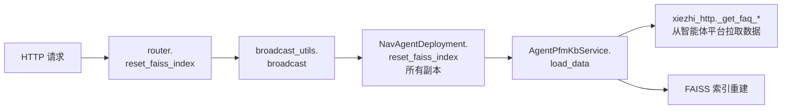
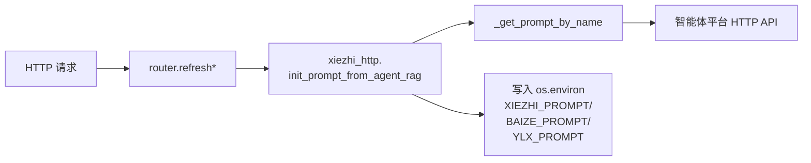

# 模块依赖图

> 本文档由 Kris 在接手项目时整理（2026-05），目标：
> 1. 让接手者一眼看懂"代码是怎么组织的、谁依赖谁"
> 2. 为后续阶段 5 拆分 `xiezhi_http.py` 和 `shouxian_nav_service.py` 提供依据

---

## 一、Ray Serve Deployment 拓扑（应用启动时构建）

定义在 [`src/ark_nav/serve_app.py:42-69`](../serve_app.py#L42)。`build_app()` 用 `.bind()` 把各个 Deployment 串成 DAG（有向无环图）。



**调用方式说明**：
- `RAGModelDeployment.bind()` —— 绑定一个无依赖的模型 deployment
- `IntentClassifyAgentDeployment.bind(rag_models, shouxian_bert)` —— 把 RAG 和 BERT 注入进来（类似 Spring `@Autowired`）
- 上层 deployment 通过 Ray actor handle 远程调用下层 deployment 的方法（`.method.remote(args)`）

**与 Java 的类比**：把 Ray Deployment 想成 Spring 的 `@Service` Bean，`.bind()` 就是 `@Autowired` 构造函数注入，`.remote()` 就是 RPC 调用。Ray 自己负责负载均衡、自动扩缩容、故障转移。

---

## 二、目录结构与分层

```
src/ark_nav/
├── serve_app.py              ← 应用入口 (main + build_app)
├── ark_nav_api.py            ← FastAPI HTTP 总入口 (APIDeployment)
├── config.py                 ← Pydantic Settings（管模型路径/端口/日志，未广泛用）
│
├── core/                     ← 公共能力层（不分 domain）
│   ├── models/
│   │   └── rag_models.py     ← RAGModelDeployment（Embedding + Reranker）
│   ├── services/
│   │   ├── rag_service.py            ← HybridRetriever（混合检索：FAISS + BM25 + Rerank）
│   │   ├── xiezhi_http.py    ★ 577行  ← LLM 调用 + KB 客户端 + Prompt 管理（上帝类，阶段 5 拆）
│   │   ├── agent_pfm_kb_service.py   ← FAISS 向量库管理（构建/加载/查询）
│   │   ├── data_pusher_service.py    ← 异步推送数据到 DataPulse / Argilla
│   │   ├── data_masking_service.py   ← 敏感信息脱敏（身份证/手机/邮箱/银行卡）
│   │   ├── gpt_signature.py          ← HMAC-SHA1 签名（app_key/secret 认证）
│   │   ├── open_ai_signature.py      ← RSA SHA256 签名（平安 LLM 认证）
│   │   └── rag_service.py            ← 同上（重复列了，保留位置示意）
│   └── utils/
│       ├── nav_logger.py             ← structlog 封装 + trace_id ContextVar
│       ├── trace_id_middleware.py    ← FastAPI 中间件，注入 X-Request-ID
│       ├── http_client_manager.py    ← httpx.AsyncClient 单例管理（连接池）
│       ├── httpx_deployment_decorator.py ← @with_http_client() 装饰器
│       ├── broadcast_utils.py        ← Ray Serve 副本间广播工具（reset_faiss 用）
│       ├── llm_platform_config.py    ← LLMPlfConfig 配置类
│       └── agent_platform_config.py  ← AgentPfmConfig 配置类
│
└── domains/                  ← 业务层（按业务线分目录）
    ├── shouxian/             ← 寿险
    │   ├── shouxian_api_router.py    ← /api/v1/shouxian/* 路由定义
    │   ├── router_schemas.py         ← Pydantic schemas (ChatCompletionRequest 等)
    │   ├── intent_classifier_simple.py    ← 意图识别策略 1：基础 prompt
    │   ├── intent_classifier_advance.py   ← 意图识别策略 2：并行 + 早返回
    │   ├── intent_classifier_cot.py       ← 意图识别策略 3：CoT + Few-Shot
    │   ├── agents/
    │   │   ├── nav_agent.py                  ← NavAgentDeployment（入口）
    │   │   └── intent_classify_agent.py      ← IntentClassifyAgentDeployment（编排意图识别）
    │   ├── models/
    │   │   └── bert.py                       ← ShouxianBertDeployment（寿险 BERT 模型）
    │   └── services/
    │       ├── shouxian_nav_service.py  ★ 523行  ← 主业务编排（阶段 5 拆）
    │       └── shouxian_rag_service.py       ← 寿险 RAG 包装
    │
    └── yanglaoxian/          ← 养老险
        ├── ylx_api_router.py             ← /api/v1/ylx/* 路由定义
        ├── router_schemas.py             ← Pydantic schemas (YLXRequest 等)
        ├── agents/
        │   └── ylx_nav_agent.py          ← NavYLXAgentDeployment（入口）
        └── services/
            └── onekey_service.py         ← 一键导航服务 + 小安机器人
```

**分层观察**：
- ✅ **core 与 domains 解耦**：core 不依赖任何 domain（只有 domains 反向依赖 core）
- ⚠️ **shouxian 与 yanglaoxian 几乎完全独立**：两个 domain 互不引用，只共享 core
- ⚠️ **`ylx_nav_agent.py` 引用了 `domains/shouxian/router_schemas.IntentResult`**（ylx_nav_agent.py:9）—— 这是**唯一**的 domain 间反向依赖，是历史耦合

---

## 三、API 调用链（每条 API 一条链路）

### 3.1 寿险主链路：`POST /api/v1/shouxian/nav_agent`



### 3.2 养老险主链路：`POST /api/v1/ylx/navi`



### 3.3 知识库刷新：`POST /api/v1/{shouxian,ylx}/reset_faiss_index`



> ⚠️ 见 [API_INVENTORY.md BUG-1](API_INVENTORY.md)：养老险路由的 broadcast 也写到了 `NavAgentDeployment`（应为 `NavYLXAgentDeployment`），导致养老险这条链路实际未走通。

### 3.4 Prompt 刷新：`GET /{shouxian/refresh_prompt, ylx/refresh}`



---

## 四、`xiezhi_http.py` 内部函数清单（阶段 5 拆分依据）

`xiezhi_http.py` 共 577 行、16 个顶层函数（按文件中位置排序）：

| 函数 | 行 | 职责类别 | 阶段 5 拆到哪 |
|------|---|---------|------------|
| `call_bigmodel_api` | :22 | LLM 调用 | `xiezhi/llm_client.py` |
| `init_prompt_from_agent_rag` | :105 | Prompt 拉取 | `xiezhi/prompt_repository.py` |
| `_assemble_req_payload` | :124 | KB 请求组装 | `xiezhi/kb_client.py` |
| `_get_kb_url` | :179 | KB URL 工具 | `xiezhi/kb_client.py` |
| `_get_faq_page_url` | :186 | KB URL 工具 | `xiezhi/kb_client.py` |
| `_get_faq_page_similar_url` | :193 | KB URL 工具 | `xiezhi/kb_client.py` |
| `_get_faq_table_detail_url` | :200 | KB URL 工具 | `xiezhi/kb_client.py` |
| `_get_faq_table_list_url` | :207 | KB URL 工具 | `xiezhi/kb_client.py` |
| `search_kb` | :214 | KB 搜索 | `xiezhi/kb_client.py` |
| `extract_answer` | :283 | KB 响应解析 | `xiezhi/kb_client.py` |
| `_get_prompt_by_name` | :312 | Prompt 拉取（内部） | `xiezhi/prompt_repository.py` |
| `_get_agent_auth_token` | :331 | 认证 | `xiezhi/auth.py` |
| `_get_faq_page_data` | :363 | KB FAQ 数据 | `xiezhi/kb_client.py` |
| `_get_faq_table_data` | :468 | KB Table 数据 | `xiezhi/kb_client.py` |
| `fetch_rag` | :552 | RAG 高层入口 | `xiezhi/llm_client.py` 或保留在新 `xiezhi/__init__.py` |
| `main` | :568 | 调试入口 | 删除（脚本应放 scripts/） |

**拆分目标结构**（阶段 5 实施）：
```
core/services/xiezhi/
├── __init__.py              ← re-export 全部公开函数，保证 import 路径不变
├── llm_client.py            ← call_bigmodel_api, fetch_rag
├── kb_client.py             ← search_kb, extract_answer, _get_kb_url, _get_faq_*, _assemble_req_payload
├── prompt_repository.py     ← init_prompt_from_agent_rag, _get_prompt_by_name
└── auth.py                  ← _get_agent_auth_token
```

**保证向后兼容**：原文件位置改为 `core/services/xiezhi.py`（或保留 `xiezhi_http.py` re-export），任何 `from ark_nav.core.services.xiezhi_http import xxx` 仍能工作。

---

## 五、`xiezhi_http.py` 的反向依赖（谁在调用它）

为了拆分时知道改名/搬位置会影响谁，列出**所有 import xiezhi_http 的位置**：

```
src/ark_nav/domains/shouxian/shouxian_api_router.py:15
    from ark_nav.core.services.xiezhi_http import init_prompt_from_agent_rag

src/ark_nav/domains/shouxian/intent_classifier_simple.py
    from ark_nav.core.services.xiezhi_http import call_bigmodel_api

src/ark_nav/domains/shouxian/intent_classifier_advance.py
    from ark_nav.core.services.xiezhi_http import call_bigmodel_api

src/ark_nav/domains/shouxian/intent_classifier_cot.py
    from ark_nav.core.services.xiezhi_http import call_bigmodel_api, fetch_rag

src/ark_nav/domains/shouxian/services/shouxian_nav_service.py
    from ark_nav.core.services.xiezhi_http import fetch_rag, call_bigmodel_api  (待 grep 确认)

src/ark_nav/domains/shouxian/services/shouxian_rag_service.py
    from ark_nav.core.services.xiezhi_http import ... (待 grep 确认)

src/ark_nav/domains/yanglaoxian/agents/ylx_nav_agent.py:7
    from ark_nav.core.services.xiezhi_http import call_bigmodel_api, fetch_rag

src/ark_nav/domains/yanglaoxian/ylx_api_router.py:12
    from ark_nav.core.services.xiezhi_http import init_prompt_from_agent_rag

src/ark_nav/domains/yanglaoxian/services/onekey_service.py
    from ark_nav.core.services.xiezhi_http import ... (待 grep 确认)
```

**外部使用的公开 API 仅 4 个**：
1. `call_bigmodel_api` — LLM 调用
2. `fetch_rag` — RAG 检索
3. `init_prompt_from_agent_rag` — Prompt 刷新
4. `search_kb` —（如有调用，待确认）

阶段 5 拆分时，只要保证这 4 个能从原路径 import，其他内部 `_xxx` 函数随便搬。

---

## 六、`shouxian_nav_service.py` 内部结构（阶段 5 拆分依据）

[`shouxian_nav_service.py`](../domains/shouxian/services/shouxian_nav_service.py) 共 523 行，混合了多个 service 类。后续阶段 5 进入这一步时，再做一次精读 + 拆分清单。

**初步观察**（基于 grep 行号）：
- 含至少 5 个 class（具体边界待精读）
- 同时管：意图识别编排、RAG 调用、卡片提取、寿险红利渠道（ESG_CLIENT_ID_4_BONUS）认证、token 缓存

**初步拆分方案**：
- `shouxian/services/intent_recognition_service.py` ← 意图识别编排
- `shouxian/services/card_extraction_service.py` ← 卡片提取
- `shouxian/services/bonus_auth_service.py` ← 红利渠道认证 + token 缓存
- `shouxian/services/shouxian_nav_service.py` ← 仅保留主入口 `ShouXianNavService.run()`

详细拆分计划在阶段 5 落地前再补充。

---

## 七、ShouXian / YLX 重复实现对照

| 功能 | 寿险位置 | 养老险位置 | 重复度 | 阶段 5 处理 |
|------|---------|----------|--------|------------|
| `reset_faiss_index` 路由 | shouxian_api_router.py:112 | ylx_api_router.py:92 | 99%（broadcast 调用） | 抽到 `core/services/faiss_admin.py` 公共函数 |
| `reset_faiss_index` Deployment 方法 | nav_agent.py:46 | ylx_nav_agent.py:166 | 100%（完全相同） | 抽到 mixin 或基类 |
| `refresh_prompt` 路由 | shouxian_api_router.py:85 | ylx_api_router.py:25 | 90%（仅返回字段不同） | 文档化保留差异 |
| 流式响应 SSE 包装 | shouxian_api_router.py:42-79 | ylx_api_router.py:49-86 | 95%（连"寿险红利"中文都没改） | 抽公共流式工具 |
| `process` Agent 入口 | nav_agent.py:41 | ylx_nav_agent.py:62 | 命名同步重叠 | 不动（两边业务流不同） |

---

## 八、阶段 5 拆分顺序建议

按"风险从低到高"：

1. **先拆 `xiezhi_http.py` 的 prompt_repository**（3 个函数，与外部交互最少）
2. **再拆 `xiezhi_http.py` 的 auth + kb_client**（多个 `_xxx` 私有函数）
3. **最后拆 `xiezhi_http.py` 的 llm_client**（公开函数最多，影响面最大）
4. **再拆 `shouxian_nav_service.py`**（业务逻辑复杂，需要精读后单独定方案）
5. **最后抽 shouxian/yanglaoxian 公共代码**（reset_faiss、流式 SSE）

每一步独立 PR，原文件保留 re-export 占位，回归通过后再删 re-export。
